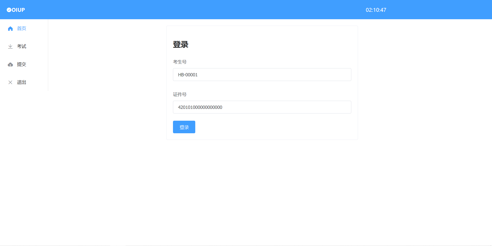
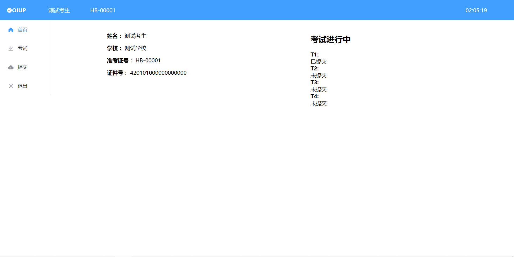
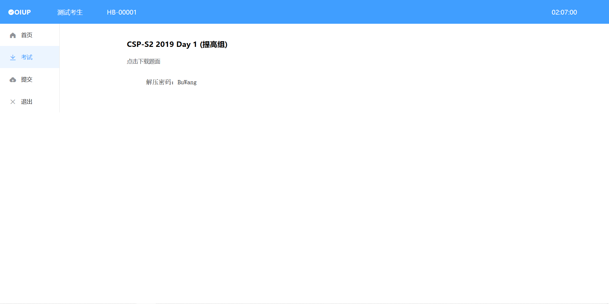
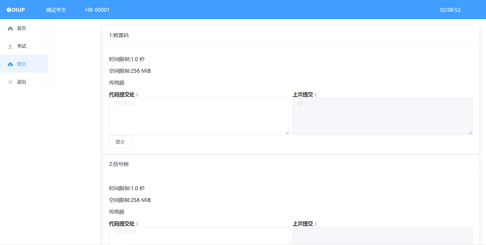
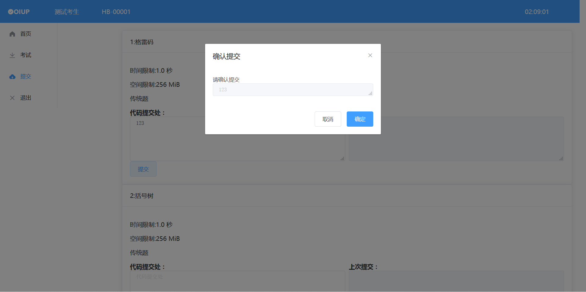
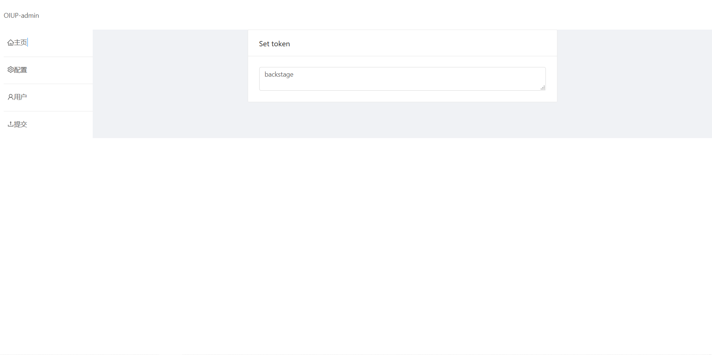
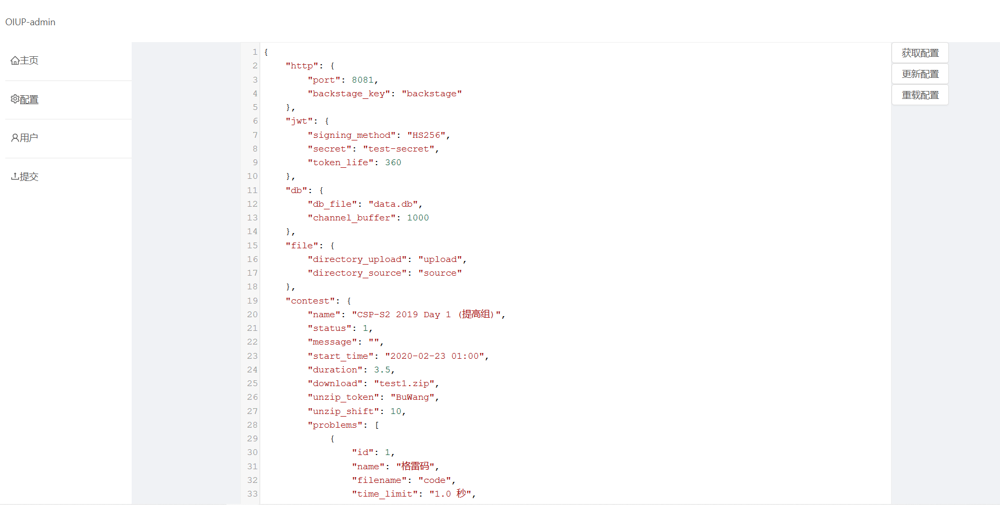
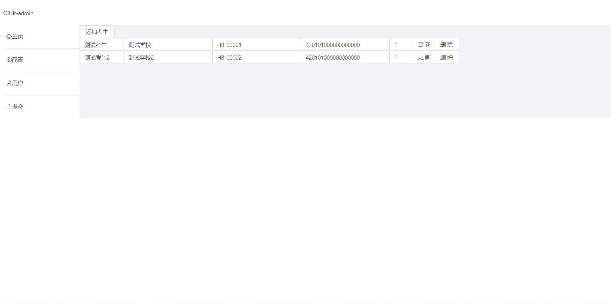
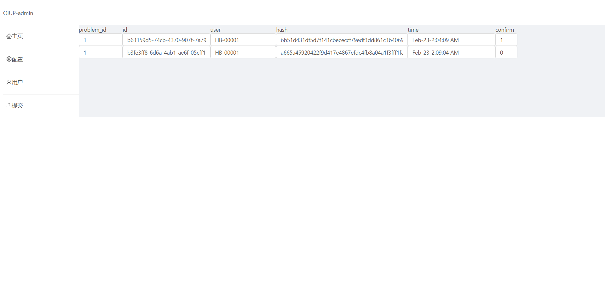

# OIUP 竞赛源代码提交系统 使用文档

## 简介

OIUP 竞赛源代码提交系统是一个用于收集算法竞赛考生源代码，以便进行评测等后续工作的系统。本系统为网络应用，需要将应用配置在服务器后，在客户端的浏览器中进行操作。本项目前端由 [Margatroid](https://github.com/Enter-tainer) 开发，后端由 [KSkun](https://github.com/KSkun) 开发。

## 使用

### 运行服务端

在工作目录下打开命令行工具，运行 `run`（Windows 命令提示符）或 `./run.sh`（Linux shell），出现窗口，说明服务已开始运行。

启动服务端时，命令行中会自动生成 5 个用于作为随机密码的 UUID 串，你可以将其作为配置文件中的 `backstage_key` 或 `secret` 字段的值，以防选手考试时恶意攻击系统造成严重后果。

服务端运行过程中，命令行会打印选手登录和提交的信息。

## 修改配置文件

下面是一份示例配置文件：

```json
{
  "http": {
    "port": 80,
    "backstage_key": "backstage"
  },
  "jwt": {
    "signing_method": "HS256",
    "secret": "test-secret",
    "token_life": 360
  },
  "db": {
    "db_file": "data.db",
    "channel_buffer": 1000
  },
  "file": {
    "directory_upload": "upload",
    "directory_source": "source"
  },
  "contest": {
    "name": "CSP-S2 2019 Day 1 (提高组)",
    "status": 1,
    "message": "",
    "start_time": "2020-02-23 01:00",
    "duration": 3.5,
    "download": "test.zip",
    "unzip_token": "unzip",
    "unzip_shift": 10,
    "problems": [
      {
        "id": 1,
        "name": "格雷码",
        "filename": "code",
        "time_limit": "1.0 秒",
        "space_limit": "256 MiB",
        "type": 1,
        "testcase": 20
      },
      {
        "id": 2,
        "name": "括号树",
        "filename": "brackets",
        "time_limit": "1.0 秒",
        "space_limit": "256 MiB",
        "type": 1,
        "testcase": 20
      },
      {
        "id": 3,
        "name": "树上的数",
        "filename": "tree",
        "time_limit": "2.0 秒",
        "space_limit": "256 MiB",
        "type": 1,
        "testcase": 20
      },
      {
        "id": 4,
        "name": "一道提答题",
        "filename": "submit",
        "time_limit": "-",
        "space_limit": "-",
        "type": 2,
        "testcase": 20
      }
    ]
  }
}
```

下面给出部分字段的定义，不推荐修改的字段不给出定义：

| **字段名**        | **默认值**    | **说明**                                                     |
| ----------------- | ------------- | ------------------------------------------------------------ |
| **http 块**       |               |                                                              |
| port              | 80            | 服务端运行的端口号                                           |
| backstage_key     |               | 后台管理令牌                                                 |
| **jwt 块**        |               |                                                              |
| secret            | "test-secret" | 用于生成令牌的签名 secret，使用前请更改该字段                |
| token_life        | 360           | 令牌的有效时间，单位为分钟                                   |
| **db 块**         |               |                                                              |
| db_file           | "data.db"     | 数据库文件名                                                 |
| **file 块**       |               |                                                              |
| directory_upload  | "upload"      | 上传临时文件存放目录名                                       |
| directory_source  | "source"      | 生成指定目录结构的提交文件存放目录名                         |
| **contest 块**    |               |                                                              |
| name              |               | 比赛名                                                       |
| status            | 1             | 比赛状态，默认值 1 为正常状态，如遇异常状况请更改该值为 -1   |
| message           | ""            | 比赛异常信息，如遇异常状况请更改该值为具体异常信息           |
| start_time        |               | 比赛开始时间，格式为YYYY-MM-DD HH:MM                         |
| duration          |               | 比赛持续时间，单位为时                                       |
| download          |               | 试题文件名，试题需要存放在 `./static/file` 目录下            |
| unzip_token       |               | 试题解压密码，考试前指定时间会公布                           |
| unzip_shift       | 10            | 试题解压密码公布时间的提前量，单位为分钟，10 表示提前 10 分钟公布解压密码 |
| **problems 子块** |               |                                                              |
| id                |               | 题目编号，不能有多个题目使用同一编号                         |
| name              |               | 题目中文名                                                   |
| filename          |               | 题目文件名                                                   |
| time_limit        |               | 题目时间限制                                                 |
| space_limit       |               | 题目空间限制                                                 |
| type              |               | 题目类型，1 传统题，2 提交答案题，3 交互题                   |
| testcase          |               | 题目测试点数量                                               |

## 选手界面

进入选手界面前，选手需要输入自己的准考证号和证件号登录系统：



选手界面如下图所示：



选手可在此界面查看自己的基本信息、考试状态和提交状态。其中右上角的时间与服务端时间校对，因此需要保证服务端时间准确。

在考试界面（如下图），选手可以下载试题包、查看解压密码。解压密码仅在考试开始前指定时间（默认为提前 10 分钟）公布。



在提交界面（如下图），选手可以根据各个题目提交代码、输出文件。提交后有一步确认提交，选手只有在检查上传文件内容无误后才算完成一次提交。





提交传统题、交互题时，只需要将完整的代码文本复制进文本框中，再进行提交、确认提交操作即可。提交提交答案题时，需要单击选择文件按钮，并在弹出的窗口中选中所有需要上传的输出文件，输出文件必须按照规范命名（如：`problem1.out`，编号从 1 开始），否则将可能出现错误。再次提交时，**提交内容会覆盖上一次提交的所有内容**，因此如果想补充提交答案题的输出文件，需要再次上传已经提交过的文件。

选手单击退出后即退出系统，需要重新登录才能进入。

## 后台管理界面

进入后台管理界面前，需要在设置令牌界面设置令牌，令牌为配置文件中的后台管理令牌：



在配置页面，可以在网页中修改配置文件、获取最新配置文件或重新加载本地配置文件等操作



在用户界面，可以进行添加用户、更新用户信息等操作（最后一栏为考生使用的语言，1 C++，2 C，3 Pascal）。



在提交界面，可以查询用户的提交信息



## 获取选手解答文件

工作目录下的 `./source` 文件夹（默认值，参见配置文件）中包含了按照 NOI 规定格式（即子文件夹式）生成的选手解答文件，比赛解释后拷贝该文件夹至评测环境中即可。

## 其他信息

本项目预发布版本二进制文件分别在 Windows 10 64 位 和 Ubuntu 18.04 LTS 64 位 下编译，理论上仅能在相同的 64 位平台上运行。如需要适用于其他平台的二进制文件，可以自行编译。

本项目后端部分使用 GPL-3.0 协议。


